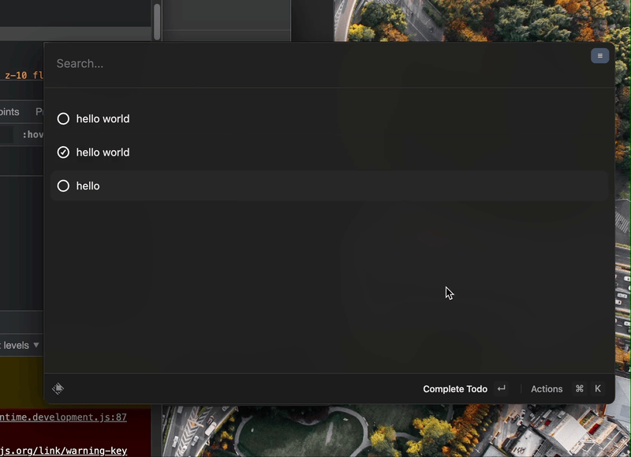

# Blast Launcher (aka C8763)

<!--toc:start-->
- [Blast Launcher (aka C8763)](#blast-launcher-aka-c8763)
  - [Demo](#demo)
  - [Architecture](#architecture)
  - [Development](#development)
  - [Inspiration and related projects](#inspiration-and-related-projects)
  - [FAQs](#faqs)
    - [Why naming blast?](#why-naming-blast)
    - [Why C8763?](#why-c8763)
  - [Learning Resources](#learning-resources)
  - [License](#license)
<!--toc:end-->

Blast is an open-source educational and experimental project that aims to
utilize the extension ecosystem of [Raycast Launcher](https://raycast.com)

Raycast is a SaaS software, while providing paid subscription services for teams,
for personal is copmletely free. You can also extend your workflow by building
extensions on your own. The extensions are implemented using custom React
components(`@raycast/api`), and each command within an extension can be thought
of as a separate React application. I think that's the magic of Raycast, where
everyone can easily build and integrate their own tools without much effors on
top of the huge Node.js and React.js ecosystem.

While Raycast is great, it is a closed-source software and the extension ecosystem
can only be used in Raycast. So here's where this project comes in.

Blast provides an open-source React renderer to render these Raycast extensions.

## Demo



## Architecture

Blast uses the following components:

- Node.js to write the backend and implement a custom React renderer with `react-reconciler`
- Electron & React.js to write the front end and render the React element tree as HTML
- Use `rpc-websockets` to communicate between the backend and front end

In the architecture of Blast, the backend uses Node.js and the `react-reconciler` package to implement a custom React renderer. The element tree created during this process is then emitted as a JSON object tree to the front end, which is an Electron app built with React.js and rendered as HTML. While the front end is built with React, it is also framework agnostic as it can accept the plain JSON element tree from the backend.

For higher performance, a custom renderer such as React-native may send operations to the host app to build a shadow element tree alongside the renderer. However, Blast was designed for educational and experimental purposes and therefore emits the entire element tree as JSON during the resetAfterCommit phase, which is called every time the component is updated. This is less performant but sufficient for the needs of this project as the component tree is not complex and high performance is not required.

You can learn more about the blast architecture in the following documents:

- [`@blastlauncher/renderer`](./packages/blast-renderer/README.md): The custom React renderer
- [`@blastlauncher/runtime`](./packages/blast-runtime/README.md): The backend and runtime application, which is also a React.js app
- [`@blastlauncher/api`](./packages/blast-api/README.md): Polyfill for the Raycast API
- [`@blastlauncher/cli`](/packages/blast-cli/README.md): A CLI tool that manage to build/publish raycast extension to blast compatible module. Really much alike the ray-cli tool.

## Development

```bash
# Make sure you have pnpm v7 installed, then install dependencies with pnpm
pnpm install

# Start build
pnpm run watch

# Start front end in dev mode
pnpm run start:client
```

## Inspiration and related projects

- [SunbeamLauncher](https://github.com/SunbeamLauncher/sunbeam): A frontend agnostic Launcher app, written in Go, and you can write extensions in any language.
- [⌘K, cmdk](https://github.com/pacocoursey/cmdk): A React.js Component to build Launcher app UI. The front end of Blast is based on this project. The author also provided several launcher themes, such as Linear, Raycast and Vercel,but they are only for demo purposes so you need to modify them to use.
- [Sittly Launcher](https://github.com/JulianKominovic/sittly-launcher): Another project inspired by raycast! I discovered it while regularly searching for projects with the "raycast" keyword on GitHub. 😂 Oops, sorry for the early spoiler.

## FAQs

### Why naming blast?

Our Chief Marketing Officer(nickname ChatGPT) gave me this idea.

I was asking him to come up with words similar to "raycast".

### Why C8763?


Blast（爆破）應該滿星爆的吧！但星爆氣流斬原文是 starburst stream。算了。

## Links

- Resources to learn how to build a custom React Renderer
  - Jam Risser – [Building a Custom React Renderer](https://www.youtube.com/watch?v=SXx-CymMjDM)
    - and the example code: <https://github.com/clayrisser/create-react-renderer>
  - [ReactDOM Reconciler Host config](https://github.com/facebook/react/blob/main/packages/react-dom-bindings/src/client/ReactDOMHostConfig.js)
- About Blast
  - Blast Launcher introduction post(Written in Chinese): [Blast：一個能執行 Raycast 擴充功能的 React.js 渲染器](https://yukai.dev/blog/2023/01/02/blast-the-raycast-extension-react-renderer)

## License

MIT

