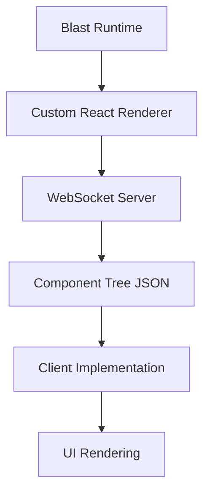
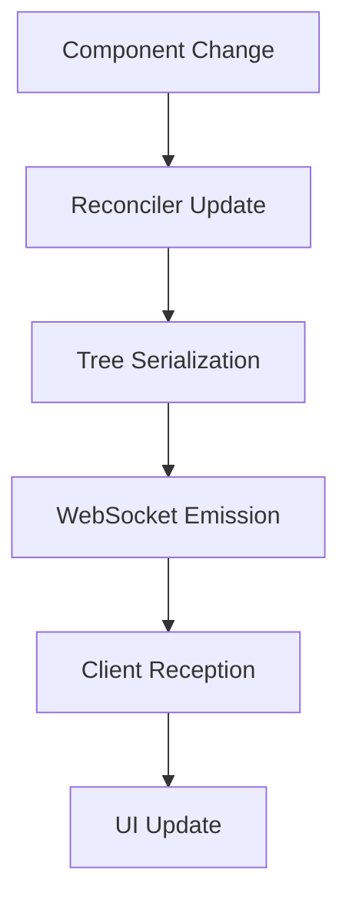
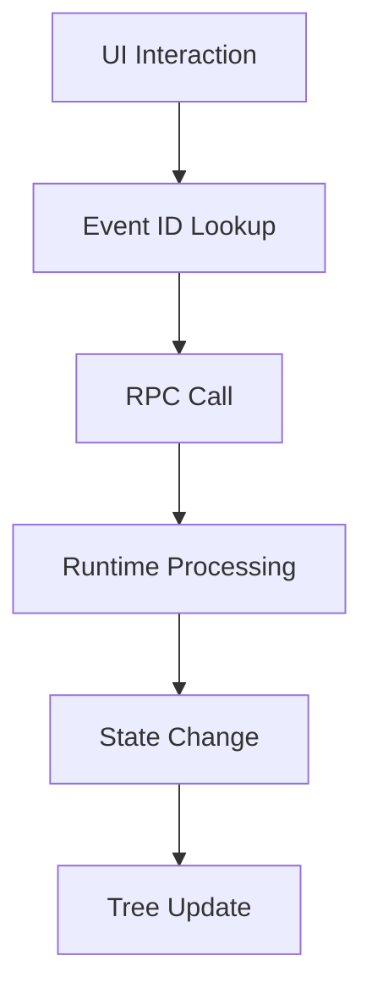

# Blast App Flow Documentation

## 1. Core Architecture Overview

A React-based architecture that separates UI rendering from business logic through WebSocket communication.



File Structure:
```
apps/
└── electron-client/          # Reference client implementation
    ├── src/
    │   ├── main/            # Electron main process
    │   │   ├── runtime.ts   # Runtime process management
    │   │   └── window.ts    # Window management
    │   └── renderer/        # Electron renderer process
    │       ├── App.tsx      # Main UI component
    │       ├── components/  # UI components
    │       └── store/       # WebSocket state
    └── public/              # Static assets
packages/
├── blast-renderer/          # Custom React renderer
├── blast-api/               # Raycast API compatibility
└── blast-runtime/           # Extension runtime
```

## 2. Package Structure

Each package serves a specific role in the architecture:

1. **blast-renderer**: Core rendering engine that creates and serializes React component trees
   ```typescript
   // packages/blast-renderer/src/renderer/reconciler.ts
   // Handles component tree serialization and WebSocket communication
   resetAfterCommit: function (containerInfo: Container): void {
     const jsonTree = containerInfo.serialize();
     server.emit("updateTree", jsonTree);
   }
   ```

2. **blast-api**: Raycast API compatibility layer with additional Blast-specific utilities
   ```typescript
   // packages/blast-api/src/index.ts
   // Exports Raycast-compatible components and utilities
   export {
     List,
     LocalStorage,
     useNavigation,
     // ...other exports
   }
   ```

3. **blast-runtime**: Main application runtime that manages extensions and UI state
   ```typescript
   // packages/blast-runtime/src/index.ts
   // Runtime initialization and server setup
   export function run({ host = "localhost", port = 8763 } = {}) {
     runApp(App, {
       server: runServer({ host, port }),
     });
   }
   ```

## 3. Component Tree Flow

The system uses a custom React reconciler to build and maintain component trees:

1. **Tree Generation**: Creates serializable component trees using custom React reconciler
   ```typescript
   // packages/blast-renderer/src/renderer/render.ts
   // Root component initialization and reconciler setup
   export function render(component: React.ReactNode, server?: Server) {
     const rootElement = new Command({ server });
     const root = JSONTreeRenderer.createContainer(/* ... */);
   }
   ```

2. **Element Types**: Defines all available component types for the system
   ```typescript
   // packages/blast-renderer/src/renderer/elements/types.ts
   // Component type definitions for serialization
   export const Action = "Action";
   export const List = "List";
   // ...
   ```

## 4. Event System

Implements a WebSocket RPC-based event system:

1. **Event Registration**: Creates unique event IDs and registers handlers
   ```typescript
   // packages/blast-api/src/Action/index.tsx
   // Action component with event handling
   export const Action = (props: RAction.Props) => {
     const actionId = useId();
     const actionEventName = useMemo(() => `action${actionId}`, [actionId]);
     useServerEvent(actionEventName, fn);
   };
   ```

2. **Client Event Handling**: Manages UI events and WebSocket communication
   ```typescript
   // apps/electron-client/src/renderer/components/List/index.tsx
   // Client-side event delegation
   if (matchedAction?.props?.actionEventName) {
     ws.call(matchedAction.props.actionEventName);
   }
   ```

## 5. Runtime Behavior

Manages extension loading and execution:

1. **Command List**: Main interface for displaying and executing commands
   ```typescript
   // packages/blast-runtime/src/components/CommandList/index.tsx
   // Command list implementation with navigation
   export const CommandList = () => {
     const { data: commands } = usePromise(loadCommands);
     return (
       <List>
         {commands.map(command => (
           <List.Item actions={/* ... */} />
         ))}
       </List>
     );
   };
   ```

## 6. Client Implementation

Framework-agnostic client with Electron reference implementation:

1. **Main Client**: Renders component trees and manages UI state
   ```typescript
   // apps/electron-client/src/renderer/App.tsx
   // Client-side tree rendering
   export const App = () => {
     const { tree } = useRemoteBlastTree();
     return <TreeComponent blastProps={tree} />;
   };
   ```

## 7. Data Flow

Defines how data and events flow through the system:





## 8. Extension Integration

Handles extension loading and execution:

1. **Extension Loading**: Loads and evaluates extension modules
   ```typescript
   // packages/blast-runtime/src/components/CommandList/utils.ts
   // Extension module evaluation
   export const evalCommandModule = (requirePath: string) => {
     const module = require(requirePath);
     return module.default || module;
   };
   ```

2. **Environment Setup**: Manages extension environment
   ```typescript
   // packages/blast-api/src/environment.ts
   // Extension environment preparation
   export const prepareEnvironment = (env, callback) => {
     const previousEnv = { ...process.env };
     Object.assign(process.env, env);
     callback();
   };
   ```

This architecture enables:
- Clear separation of concerns
- Framework-agnostic client implementations
- Extensible component system

The modular design allows different client implementations while maintaining a consistent extension API and component model.
