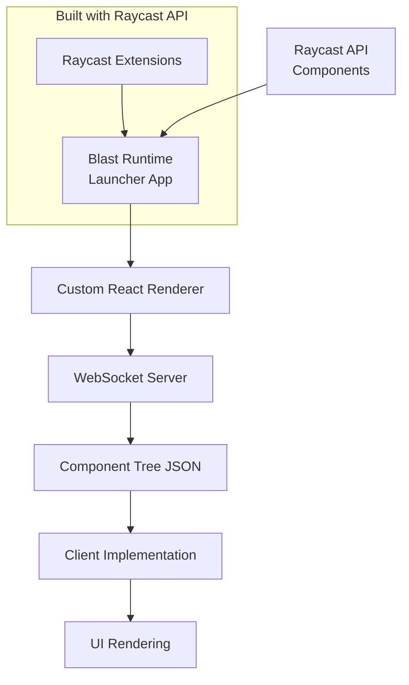
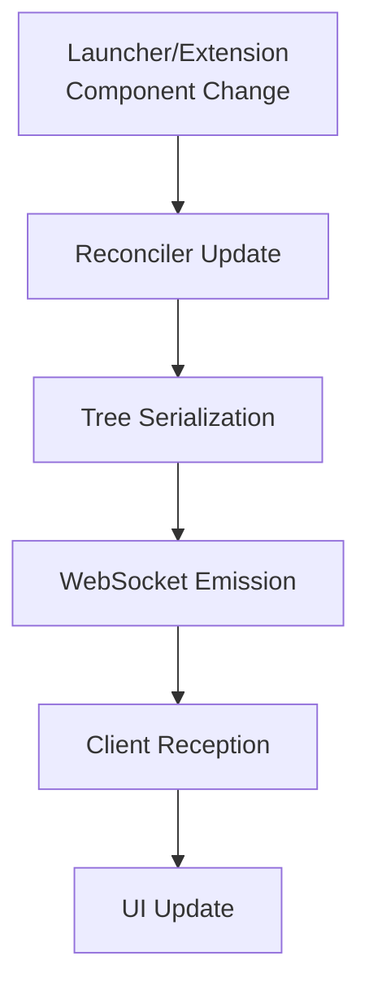
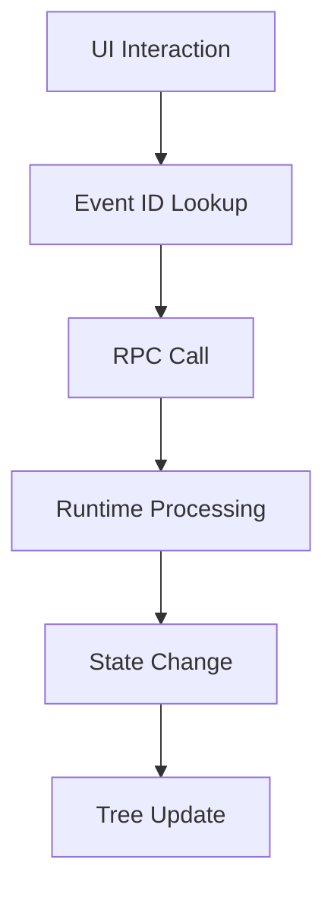

# Blast App Flow Documentation

## 1. Core Architecture Overview

Blast is a launcher application that implements Raycast-style UI and extension system. It's built using the same Raycast API patterns it supports, demonstrating the flexibility of the architecture. Through a custom React renderer, it creates a serializable component tree that can be consumed by any client implementation.



File Structure:
```
apps/
└── electron-client/          # Reference client implementation
    ├── src/
    │   ├── main/            # Electron main process
    │   │   ├── runtime.ts   # Runtime process management
    │   │   └── window.ts    # Window management
    │   └── renderer/        # Electron renderer process
    │       ├── App.tsx      # Main UI component
    │       ├── components/  # UI components
    │       └── store/       # WebSocket state
    └── public/              # Static assets
packages/
├── blast-renderer/          # Custom React renderer
├── blast-api/               # Raycast API compatibility + Blast internals
└── blast-runtime/          # Launcher application
    ├── src/
    │   ├── App.tsx         # Root launcher component
    │   ├── components/     # Core app components
    │   │   └── CommandList # Main command interface
    │   └── utils/         # Runtime utilities
```

## 2. Package Structure

Each package serves a specific role in creating a launcher that both uses and supports Raycast API:

1. **blast-runtime**: Main launcher application using Raycast components
   ```typescript
   // packages/blast-runtime/src/index.ts
   // Launcher initialization with WebSocket server
   export function run({ host = "localhost", port = 8763 } = {}) {
     console.info("Starting Blast Launcher");
     runApp(App, {
       server: runServer({ host, port }),
     });
   }
   ```

2. **blast-renderer**: Custom React renderer for serializable component trees
   ```typescript
   // packages/blast-renderer/src/renderer/reconciler.ts
   // Handles component tree serialization for both launcher and extensions
   resetAfterCommit: function (containerInfo: Container): void {
     const jsonTree = containerInfo.serialize();
     server.emit("updateTree", jsonTree);
   }
   ```

3. **blast-api**: Raycast API implementation used by both launcher and extensions
   ```typescript
   // packages/blast-api/src/index.ts
   // Exports components used by launcher and extensions
   export {
     List,
     Action,
     ActionPanel,
     // Core components
     WsContext,
     WsServerProvider,
     // Internal utilities
   }
   ```

## 3. Component System

A unified component system serving both launcher and extensions:

1. **Core Components**: Raycast-style components for UI construction
   ```typescript
   // packages/blast-renderer/src/renderer/elements/types.ts
   // Shared component types
   export const Action = "Action";
   export const List = "List";
   export const ListItem = "ListItem";
   export const ActionPanel = "ActionPanel";
   ```

2. **Launcher Interface**: Main UI built with Raycast components
   ```typescript
   // packages/blast-runtime/src/App.tsx
   export const App = ({ server }: AppProps) => {
     return (
       <WsServerProvider server={server}>
         <CommandList />  // Main interface using List component
       </WsServerProvider>
     );
   };
   ```

## 4. Event System

Unified event handling system for launcher and extensions:

1. **Event Registration**: Common event handling mechanism
   ```typescript
   // packages/blast-api/src/Action/index.tsx
   export const Action = (props: RAction.Props) => {
     const actionId = useId();
     const actionEventName = useMemo(() => `action${actionId}`, [actionId]);
     useServerEvent(actionEventName, fn);
   };
   ```

2. **Client Event Handling**: Framework-agnostic event delegation
   ```typescript
   // apps/electron-client/src/renderer/components/List/index.tsx
   // Handles events from both launcher and extensions
   if (matchedAction?.props?.actionEventName) {
     ws.call(matchedAction.props.actionEventName);
   }
   ```

## 5. Extension Integration

Extensions are loaded as commands within the launcher:

1. **Extension Loading**
   ```typescript
   // packages/blast-runtime/src/components/CommandList/utils.ts
   export const evalCommandModule = (requirePath: string) => {
     const module = require(requirePath);
     return module.default || module;
   };
   ```

2. **Extension Environment**
   ```typescript
   // packages/blast-api/src/environment.ts
   export const prepareEnvironment = (env, callback) => {
     const previousEnv = { ...process.env };
     Object.assign(process.env, env);
     callback();
   };
   ```

## 6. Data Flow

Component Tree Flow:


Event Flow:


This architecture enables:
- Launcher app built with the same API it supports
- Consistent component model across launcher and extensions
- Framework-agnostic client implementations
- Seamless extension integration

The design demonstrates the versatility of Raycast's component patterns, using them both to build the launcher itself and to support external extensions. This approach ensures consistency in behavior and development experience across the entire system.
