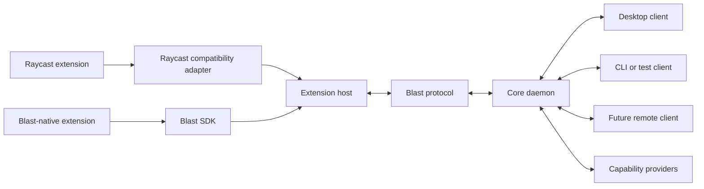

# Blast V2 architecture

## System shape



The initial implementation may run the core daemon as a child of the desktop
client. The protocol and lifecycle must not rely on that ownership arrangement.

## Responsibilities

### Protocol

`@blastlauncher/protocol` defines versioned wire messages and semantic data
shared across processes. It has no dependency on React, Electron, Node.js, or a
specific transport.

The protocol will cover:

- handshake and version negotiation;
- extension and command lifecycle;
- semantic scene mutations and user events;
- capability requests, results, and cancellation;
- structured diagnostics and shutdown.

WebSocket, local sockets, named pipes, standard I/O, and in-memory test channels
are transports for this protocol. None is the canonical architecture.

`@blastlauncher/transport` defines the shared connection interface and provides
the deterministic in-memory implementation used by protocol and lifecycle
tests. Concrete operating-system and network transports remain separate.

### Extension host

`@blastlauncher/extension-host` supervises extension sessions. It owns start,
stop, cancellation, crash reporting, and resource limits. Each untrusted
extension runs outside the core process.

Node.js is the default compatibility runtime because existing extensions depend
on Node.js behavior and packages. Other runtimes may be added for Blast-native
extensions after compatibility is measured.

### Compatibility adapter

The Raycast adapter implements the supported `@raycast/api` surface on top of
the Blast protocol and capability requests. It does not define the internal
protocol. Unsupported behavior returns a structured compatibility error.

### Core daemon

The core maintains the extension registry, active sessions, capability policy,
and connected clients. It does not render React components and does not perform
desktop operations on behalf of an extension without a capability provider.

### Clients

Clients discover commands, render semantic scenes, collect user input, and send
events. The Electron desktop application is the reference client during the V2
migration, but client-specific types must not enter the protocol package.

### Capability providers

Providers implement host operations such as clipboard access, opening URLs,
secure storage, notifications, OAuth, and selected filesystem access. Requests
include the extension identity, capability name, operation, and arguments so the
core can enforce policy and record an audit event.

## Dependency rules

```text
compat-raycast ----\
blast-api ----------> extension-host ---> transport ---> protocol
                                           ^              ^
desktop client ---------------------------+--------------+
capability providers ---------------------+--------------+
```

1. `protocol` has no workspace dependencies and no platform dependencies.
2. Clients and adapters depend on `protocol`; `protocol` never depends on them.
3. Extension code cannot import core or client internals.
4. Privileged operations cross the capability boundary.
5. Transport implementations carry protocol messages without changing their
   meaning.
6. Package consumers import public exports, never another package's `src/`
   directory.

## Session model

Every connection begins with a `hello` message listing the peer role and
supported protocol versions. The receiver selects a version in `ready` or ends
the session with a structured error. All later messages carry that version, a
message identifier, a type, and a payload.

The initial protocol scaffold intentionally defines only the common envelope
and handshake. Scene and capability messages will be added with their vertical
slices, preventing speculative wire contracts from becoming compatibility
obligations.

## Security model

Blast distinguishes two trust modes:

- **distributed:** isolated execution and only declared, brokered capabilities;
- **personal:** broader access may be granted explicitly for locally authored
  extensions and scripts.

The trust mode changes policy, not protocol shape. Remote transports require
authentication and encryption before they may carry privileged requests.

## Source layout during migration

```text
packages/blast-protocol/        V2 wire contract
packages/blast-transport/       V2 transport boundary and in-memory pair
packages/blast-extension-host/  V2 lifecycle boundary
packages/blast-api/             V1 compatibility implementation
packages/blast-runtime/         V1 runtime
packages/blast-renderer/        V1 renderer
apps/electron-client/           V1 reference client
```

New V2 packages coexist with the prototype until an end-to-end slice replaces
the useful path. Existing package names are not repurposed silently.
