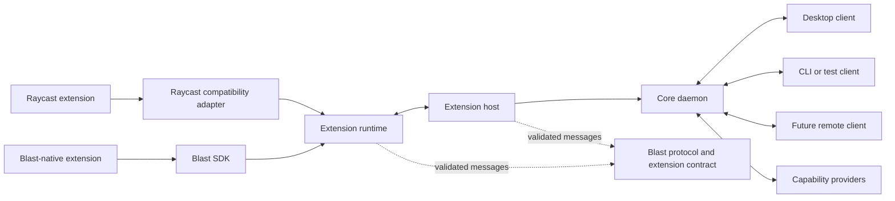
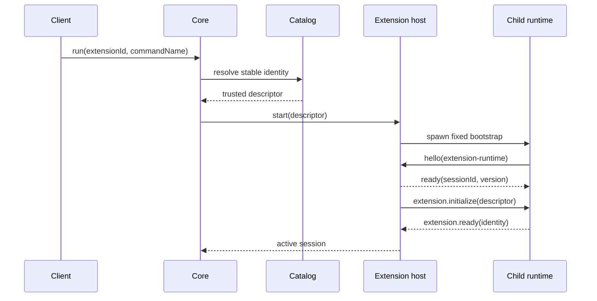

# Blast V2 architecture

## System shape



The initial implementation may run the core daemon as a child of the desktop
client. The protocol and lifecycle must not rely on that ownership arrangement.

## Responsibilities

### Protocol

`@blastlauncher/protocol` defines versioned wire messages and semantic data
shared across processes. It has no dependency on React, Electron, Node.js, or a
specific transport.

The protocol will cover:

- handshake and version negotiation;
- extension and command lifecycle;
- semantic scene mutations and user events;
- capability requests, results, and cancellation;
- structured diagnostics and shutdown.

WebSocket, local sockets, named pipes, standard I/O, and in-memory test channels
are transports for this protocol. None is the canonical architecture.

`@blastlauncher/transport` defines the shared connection interface and provides
the deterministic in-memory implementation used by protocol and lifecycle
tests. Concrete operating-system and network transports remain separate.

`@blastlauncher/session` owns the validated handshake and negotiated connection
state. The connector sends `hello`; the acceptor selects a mutually supported
version, creates the authoritative session ID, and sends `ready`. The acceptor
identity is included in `ready`, so both sides know their peer.

`@blastlauncher/transport-node` frames protocol envelopes as bounded JSON lines
over Node.js streams. It makes stdio a proven local process transport without
making stdio the architectural protocol. Standard output is protocol-only;
runtime diagnostics use standard error until structured log messages exist.

### Extension contract and runtime

`@blastlauncher/extension-contract` owns messages shared specifically by the
extension host and runtime. Protocol negotiation and extension readiness are
separate milestones: `extension.initialize` transfers the authoritative
descriptor, and `extension.ready` acknowledges that exact extension command.

`@blastlauncher/extension-runtime` implements the runtime side of this startup
contract. Module loading is an injected hook so Node.js compatibility loading,
a future alternative runtime, and deterministic tests reuse the same lifecycle.
`@blastlauncher/extension-runtime-node` ships the fixed Node bootstrap: it
negotiates the session, loads the descriptor's entrypoint through the ECMAScript
module loader, acknowledges readiness, and drains application messages until
the host shuts the session down. The bootstrap invokes the entrypoint's command
export with a context of descriptor, scene publisher, and event handler
(ADR 0008), so scene traffic flows over the same validated session before any
renderer or client exists.

### Extension host

`@blastlauncher/extension-host` supervises extension sessions. It owns start,
stop, cancellation, crash reporting, and resource limits. Each untrusted
extension runs outside the core process.

`@blastlauncher/extension-host-node` is the first concrete launcher. It spawns a
fixed bootstrap without a shell, requires an explicit environment policy,
reserves stdin/stdout for protocol traffic, drains stderr for diagnostics, and
escalates graceful shutdown to `SIGTERM` and then `SIGKILL`.

Node.js is the default compatibility runtime because existing extensions depend
on Node.js behavior and packages. Other runtimes may be added for Blast-native
extensions after compatibility is measured.

### Compatibility adapter

The Raycast adapter implements the supported `@raycast/api` surface on top of
the Blast protocol and capability requests. It does not define the internal
protocol. Unsupported behavior returns a structured compatibility error.

### Core daemon

The core maintains the extension registry, active sessions, capability policy,
and connected clients. It does not render React components and does not perform
desktop operations on behalf of an extension without a capability provider.

`@blastlauncher/core` is the first daemon-independent orchestration façade.
Clients request a stable extension and command identity; an injected trusted
catalog resolves the actual filesystem descriptor before the extension host is
called. The core coordinates in-flight startup and shutdown and now exposes
the transport-neutral one-command client session in ADR 0090: clients receive
semantic scene/toast messages and send semantic events without seeing
extension paths. ADR 0093 adds a deterministic, path-free command-discovery
snapshot for clients; persistent catalog refresh, command watching, capability
provider policy, and restart ownership are deliberate later slices.
`@blastlauncher/core-node` ships the first Node composition: its filesystem
catalog discovers Raycast-style `package.json` manifests from a root and
resolves entrypoints without ever returning a path outside the extension root;
its `NodeCoreDaemon` composes that catalog with the fixed Node host, core, and
ADR 0091 local listener. The listener is the daemon's readiness point and
delegates connections to the client session. A persistent, watched catalog
index and command watching remain later boundaries; the path-free command
discovery snapshot from ADR 0093 is now available to the client. The bounded
Node connector in ADR 0095 owns socket creation, framing, and
connection/handshake cleanup, while ADR 0098 lets Electron own that daemon
composition only when all catalog, bootstrap, and socket paths are explicitly
provided.

### Clients

Clients discover commands, render semantic scenes, collect user input, and send
events. The transport-neutral client state consumer is implemented in ADR 0094;
the Electron desktop application is the reference client during the V2
migration. ADR 0096 adds a transport-neutral client host and an opt-in Electron
main-process IPC adapter; ADR 0097 adds the corresponding opt-in semantic scene
renderer; ADR 0098 adds explicit Electron-owned daemon startup; ADR 0099
completes the first menu-bar scene renderer in that client; ADR 0101 registers
that scene in the Electron native status-item menu; ADR 0102 completes the first
V2 toast lifecycle presentation; ADR 0103 presents validated scene icon and
image sources; ADR 0104 preserves V2 action chrome fidelity; and ADR 0105
presents validated icon masks and supported tint colors. ADR 0106 presents the
validated List/Grid collection accessory boundary; ADR 0107 defines the
deterministic local List/Grid filtering boundary in the client. Client-specific
types must not enter the protocol package. ADR 0100 packages a V2 bootstrap and
maps the existing V1 production/development installation roots behind the
`BLAST_V2_MODE=packaged` configuration. ADR 0108 makes that packaged path the
default when no mode is specified, keeps the V1 renderer available through the
explicit `BLAST_V2_MODE=legacy` escape hatch, and does not add installation UI.

### Capability providers

Providers implement host operations such as clipboard access, opening URLs,
secure storage, notifications, OAuth, and selected filesystem access. Requests
include the extension identity, capability name, operation, and arguments so the
core can enforce policy and record an audit event.

`@blastlauncher/capability` defines the request/response wire contract and the
deny-by-default broker (ADR 0009). The host verifies the request identity
against the session descriptor, and a request works only when a provider is
registered and policy grants that extension the capability and operation;
denials and provider failures are structured responses, never crashes.

## Dependency rules

```text
core ---> extension-host ---> session ---> transport ---> protocol
  |             |               ^             ^
  |             +--> extension-contract       |
  |                             ^              |
  +--> client session            |              |
                                |              |
extension-runtime --------------+              |
       |                                        |
       +----------------> session --------------+

extension-host-node ---> extension-host
          +-----------> transport-node ---> transport

core-node ---> core
  +-----> scene
  +-----> capability ---> protocol
  +-----> transport-node ---> transport

extension-runtime-node ---> extension-runtime
          +---------------> transport-node ---> transport

extension-runtime ---> capability ---> protocol

react-renderer ---> scene ---> protocol

raycast-compat ---> react-renderer
```

1. `protocol` has no workspace dependencies and no platform dependencies.
2. Clients and adapters depend on `protocol`; `protocol` never depends on them.
3. Extension code cannot import core or client internals.
4. Privileged operations cross the capability boundary.
5. Transport implementations carry protocol messages without changing their
   meaning.
6. Package consumers import public exports, never another package's `src/`
   directory.
7. Client requests contain stable command identities; only a trusted catalog
   resolves entrypoint and root paths.
8. Domain packages validate their own application payloads after the common
   protocol envelope has been validated.

## Session model

Every connection begins with a `hello` message listing the connector role,
implementation, and supported protocol versions. The acceptor selects a version
in `ready` or ends the session with a structured error. `ready` contains the
selected version, one authoritative session ID, and the acceptor identity. All
later messages carry the selected version, a message identifier, a type, and a
payload.

Session states are `negotiating`, `ready`, `closing`, `closed`, and `failed`.
Only ready sessions exchange application messages. Cancellation closes a
pending negotiation, and graceful closure sends `shutdown` before closing the
transport. Transport values are untrusted until runtime protocol validation
succeeds.

The initial protocol scaffold intentionally defines only the common envelope
and handshake. Scene and capability messages will be added with their vertical
slices, preventing speculative wire contracts from becoming compatibility
obligations. The scene slice added `@blastlauncher/scene` (ADR 0007), which
validates `scene.transaction` and `scene.event` messages and materializes
transactions into client state through a transport-independent sink.

## Extension startup sequence



Only after the last acknowledgement does the command appear in
`activeSessions`. Process exit, startup failure, stopping, and stopped states
are observable through the host event stream.

## Security model

Blast distinguishes two trust modes:

- **distributed:** isolated execution and only declared, brokered capabilities;
- **personal:** broader access may be granted explicitly for locally authored
  extensions and scripts.

The trust mode changes policy, not protocol shape. Remote transports require
authentication and encryption before they may carry privileged requests.

## Source layout during migration

```text
packages/blast-protocol/        V2 wire contract
packages/blast-scene/           Semantic scene contract and mutation sink
packages/blast-capability/      Deny-by-default capability request broker
packages/blast-extension-contract/  V2 extension lifecycle messages
packages/blast-transport/       V2 transport boundary and in-memory pair
packages/blast-transport-node/  Bounded JSON-lines Node.js streams
packages/blast-session/         V2 validated session state machine
packages/blast-transport-test-suite/  Reusable transport contract tests
packages/blast-extension-runtime/  Runtime-side initialization framework
packages/blast-extension-runtime-node/  Node runtime bootstrap and entrypoint loading
packages/blast-extension-host/  Transport-neutral lifecycle supervisor
packages/blast-extension-host-node/  Node child-process launcher
packages/blast-core/            Trusted catalog and lifecycle orchestration
packages/blast-core-node/       Node catalog, daemon composition, local listener/client connector
packages/blast-client/           Transport-neutral command/scene client consumer
packages/blast-e2e/             End-to-end vertical slice fixtures
packages/blast-compatibility/   Static compatibility scanning and census
packages/blast-react-renderer/  React renderer adapter for scene transactions
packages/blast-raycast-compat/  Measured Raycast API compatibility adapter
packages/blast-api/             V1 compatibility implementation
packages/blast-runtime/         V1 runtime
packages/blast-renderer/        V1 renderer
apps/electron-client/           V1 reference client
```

New V2 packages coexist with the prototype until an end-to-end slice replaces
the useful path. Existing package names are not repurposed silently.
